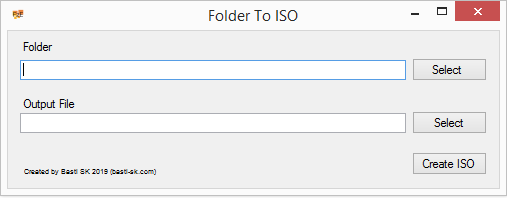

# Folder to ISO

This simple application creates an ISO File out of all files of a given folder.

Simply select a source folder and an output file and hit the `Create ISO` button.

"Folder to ISO" is a quick Windows Forms application written in in C# (.NET) and uses the [DiscUtils Nuget Package](https://github.com/DiscUtils/DiscUtils).

## Notes on Usage

Feel free to use the code as stated in the license (MIT).

**Note**: The current status of this package is 'Proof-of-Concept' meaning it contains dirty and un-tested code. Please use it accordingly.

